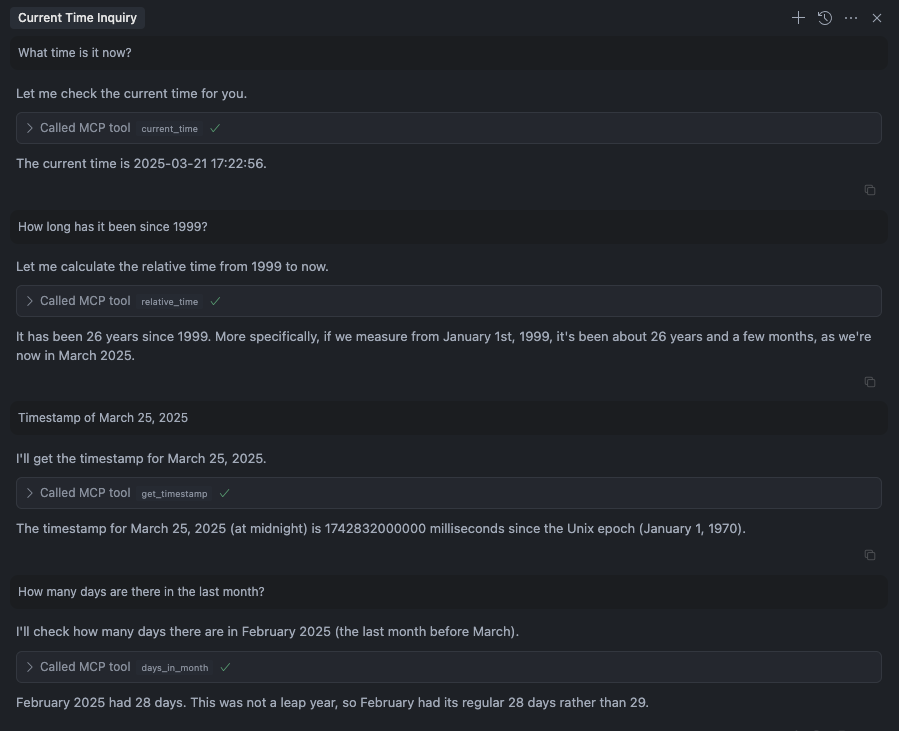

# 🚀 Time MCP Server: Giving LLMs Time Awareness Capabilities

[](https://smithery.ai/server/@yokingma/time-mcp) <a href="https://github.com/yokingma/time-mcp/stargazers"></a> <a href="https://github.com/yokingma/time-mcp/blob/main/LICENSE"></a> <a href="https://github.com/yokingma/time-mcp/issues/new"></a>

A Model Context Protocol (MCP) server implementation that allows LLMs to have time awareness capabilities.

<div align="center">
 </img>
</div>

## Tools

- `current_time`: Get current time (UTC and local time)
- `relative_time`: Get relative time
- `get_timestamp`: Get timestamp for the time
- `days_in_month`: Get days in month
- `convert_time`: Convert time between timezones
- `get_week_year`: Get week and isoWeek of the year

## Installation & Usage

### Docker (Recommended)

```bash
# Build the Docker image
docker build -t time-mcp-server .

# Run the server with SSE transport
docker run -p 3000:3000 time-mcp-server
```

The server will be available at `http://localhost:3000`

### Local Development

```bash
# Install dependencies
npm install

# Build the project
npm run build

# Run with stdio transport (default)
node dist/index.js

# Run with SSE transport
MCP_TRANSPORT=sse PORT=3000 node dist/index.js
```

### Installing via Smithery

To install time-mcp for Claude Desktop automatically via [Smithery](https://smithery.ai/server/@yokingma/time-mcp):

```bash
npx -y @smithery/cli install @yokingma/time-mcp --client claude
```

### Manually install (Optional)
```shell
npm install -g time-mcp
```

### using npx
```shell
npx -y time-mcp
```

## Setup in Claude Desktop

To use with Claude Desktop, add the server config:

On MacOS: `~/Library/Application Support/Claude/claude_desktop_config.json`
On Windows: `%APPDATA%/Claude/claude_desktop_config.json`

### Using Docker:
```json
{
  "mcpServers": {
    "time-mcp": {
      "command": "docker",
      "args": [
        "run",
        "--rm",
        "-i",
        "time-mcp-server"
      ],
      "env": {
        "MCP_TRANSPORT": "stdio"
      }
    }
  }
}
```

### Using NPX:
```json
{
  "mcpServers": {
    "time-mcp": {
      "command": "npx",
      "args": ["-y", "time-mcp"]
    }
  }
}
```

### Using Local Build:
```json
{
  "mcpServers": {
    "time-mcp": {
      "command": "node",
      "args": [
        "/path/to/time-mcp/dist/index.js"
      ]
    }
  }
}
```

## Running on Cursor

Your `mcp.json` file will look like this:

```json
{
  "mcpServers": {
    "time-mcp": {
      "command": "npx",
      "args": ["-y", "time-mcp"]
    }
  }
}
```

## Running on Windsurf

Add this to your `./codeium/windsurf/model_config.json` file:

```json
{
  "mcpServers": {
    "time-mcp": {
      "command": "npx",
      "args": ["-y", "time-mcp"]
    }
  }
}
```

## Environment Variables

- `MCP_TRANSPORT`: Transport type (`stdio` or `sse`, default: `stdio`)
- `PORT`: Port for SSE transport (default: `3000`)
- `NODE_ENV`: Node environment (`production` or `development`)

## License

MIT License - see [LICENSE](./LICENSE) file for details.
